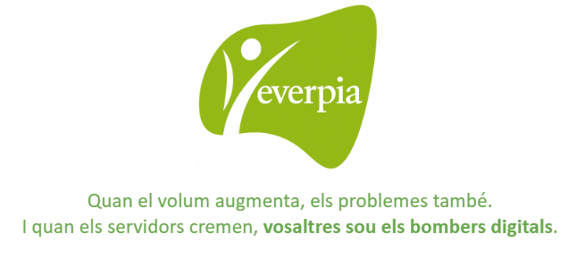

# Projecte 3: EverPia 2 – “Sobreviure en una empresa IT”

## Descripció del projecte

L’origen d’EverPia es remunta a uns anys enrere, quan vuit professors —Rubén, Isabel, Carles Alonso, Cristian, Carles Fugarolas, Natalia i Núria— van decidir unir les seves forces. Tots ells compartien una passió: la informàtica i l’educació. Però també una convicció profunda: la tecnologia no té sentit si no ajuda a les persones i a les organitzacions a créixer.

Junts van fundar la consultora EverPia, un nom que uneix *ever* (sempre) amb *Pia*, en homenatge a l’esperit educatiu i a la visió de treballar per un futur millor. La seva llegenda comença en una petita sala plena de cables i ordinadors antics, on van jurar: *Mai treballarem sols. Cada projecte serà una oportunitat per créixer junts.*

Després de mesos de feina intensa, nits de pizza i commits a última hora, la consultora EverPia ha viscut el seu primer gran èxit. Els clients estan contents, les presentacions van triomfar i, fins i tot, els tècnics van aconseguir fer funcionar el servidor… sense reiniciar-lo cada cinc minuts. Un miracle digne d’estudi.

Però com diu la llegenda del sector IT:

> “Quan tot funciona, és que no ho has mirat prou bé.”

El primer projecte va ser un èxit. Aquest segon… és una prova de supervivència. Benvinguts a **EverPia 2: “Sobreviure en una empresa IT”**, una simulació massa realista del que passa quan una empresa tecnològica comença a créixer i a rebre més clients dels que pot gestionar.

EverPia ja no és una petita consultora. Ara gestiona clients, contractes i serveis crítics 24/7. L’equip ha crescut, els projectes s’han multiplicat i el pressupost… bé, el pressupost segueix sent el mateix. Els antics alumnes heu ascendit. Sou els tècnics júnior del departament IT, i us acaben d’assignar el vostre primer gran repte: mantenir viva la infraestructura d’EverPia.

El vostre dia a dia? Apagar focs, resoldre incidències, respondre tickets, mantenir sistemes, documentar-ho tot… i, si queda temps, aprendre a no perdre els nervis. És la vida real dins una empresa IT: el caos ben documentat.

---

## 🎯 Missió del projecte

Si EverPia 1 era sobre construir, EverPia 2 és sobre **sobreviure**. La vostra missió és demostrar que sou capaços de:  

- Resoldre problemes reals d’una infraestructura IT.  
- Gestionar serveis essencials (DNS, LDAP, LVM…).  
- Treballar amb rigor tècnic i metodologia àgil.  
- Mantenir la calma mentre tot sembla fallar.  

> El coneixement és important, sí, però la serenitat és un servei premium.

---

## 💡 Objectius formatius

- Consolidar coneixements avançats en sistemes, xarxes i serveis corporatius.  
- Aplicar tècniques reals de manteniment i optimització de servidors.  
- Aprendre a resoldre problemes complexos sota pressió.  
- Practicar la documentació tècnica professional amb GitHub i Markdown.  
- Desenvolupar competències clau: treball en equip, responsabilitat, organització i autonomia.  

A EverPia 2 ja no hi ha professors: hi ha caps de projecte, companys de suport tècnic i clients impacients. Cada error és una oportunitat per aprendre. Cada “pantalla blava” és un examen de serenitat. Cada “no sé què ha passat, però ara funciona” és un triomf silenciós.

Aquest projecte no és només un conjunt de pràctiques, sinó una immersió total en el món real de les empreses IT. Aprendreu que no n’hi ha prou amb saber instal·lar, sinó que cal entendre, prevenir i comunicar.

> Lema: *“Si sobrevius a això... pots sobreviure a qualsevol empresa.”*

---

## Temes del curs

- **T01:** Control de versions amb git i GitHub  
- **T02:** Selecció d’un SAI per una empresa client  
- **T03:** Seguretat Lògica: recuperant accés a sistemes  
- **T04:** Configurant i administrant un servidor Linux  
- **T05:** El servei de DHCP: introducció teòrica  
- **T06:** El servei de DHCP: configuració pràctica  
- **T07:** Idea de negoci responsable socialment  
- **T08:** Assessorament de domini i hosting (per client assignat) - Aplicacions web  
- **T09:** Donar-se d’alta en un hosting gratuït - Aplicacions Web & PI  
- **T10:** Màsterclass de Markdown  
- **T11:** Instal·lació de WordPress en local amb WP Local – Aplicacions Web  

---

## Objectius específics

- Recuperar l'accés a sistemes amb contrasenya oblidada.  
- Fortificar l'accés al GRUB per protegir la configuració d'arrencada.

---

## Tasques a desenvolupar

- **T01:** Gestors de contrasenyes  
- **T02:** Gestió de l’emmagatzematge. Sessions teòriques  
- **T03:** Gestió flexible de discos (LVM i espais d’emmagatzematge)  
- **T04:** Serveis de Directori: LDAP  
- **T05:** Anàlisi de l’entorn: models de negoci per clients tecnològics  
- **T06:** Fonaments del servei DNS  
- **T07:** Instal·lant un servidor de noms  
- **T08:** Sitemaps i infraestructura d’una pàgina web  
- **T09:** Càlcul de la petjada

