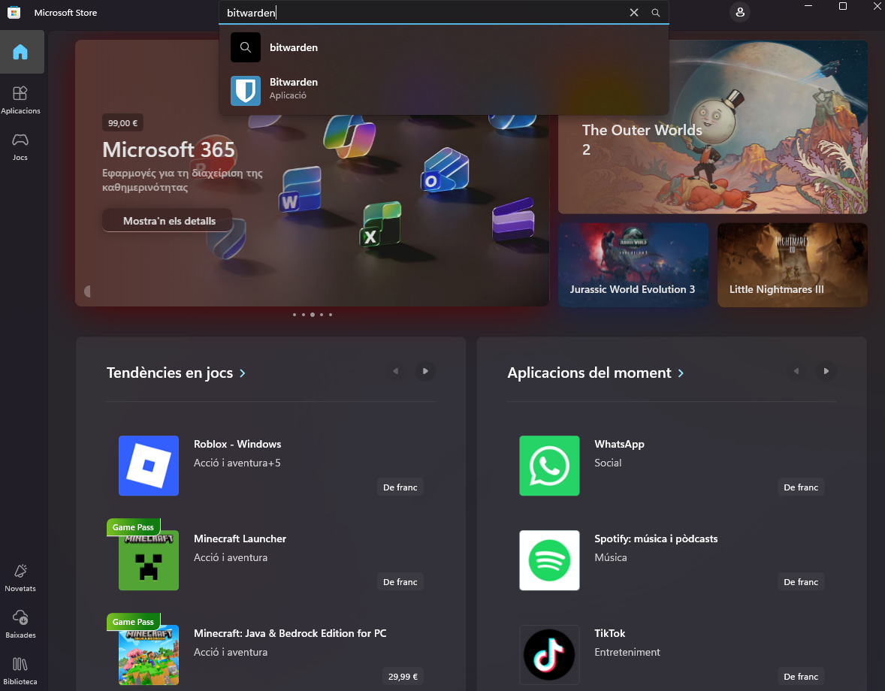

# Fase 2: Guia d'Ús Tècnica (Manual Operatiu)

- *Primer de tot, començem instal·lant l’aplicació Bitwarden:*

Busquem **Microsoft Store** al cercador de Windows i entrem.

Un cop dintre, busquem l’aplicació **Bitwarden** i seleccionem per instal·lar.

Premem a **“Baixa-ho”**, i esperem a que es completi l’instal·lació. Un cop instalada, la obrim.

Un cop dintre l’aplicació, ens ubiquem a la part inferior on diu **“Crea un compte”** i premem.

Un cop completats els següents camps, premem a **“Continua”**.

Revisem el nostre correu, ja que ens hauran enviat un email per continuar amb l’inici de sessió.

Premem a **Verificar**.

Se’ns obrirà aquesta pàgina on haurem d’establir una contrasenya que vulguem. Un cop introduïda, premem a **“Crea un compte”**.

Posteriorment, premem a **“Conseguir l’extensió”**, ja que és molt útil.

I ja estaríem dintre, amb la instal·lació completada.

# Generació de Contrasenyes Segures

Posteriorment, ens ubiquem a l’apartat esquerre i premem a **“Eines”**, i després a **Generador**. Un cop s’obri aquesta pàgina, a **“Longitud”** fiquem **12**, i més abaix marquem les quatre opcions perquè les contrasenyes siguin el més segures possible. Posem **1** a **“Mínims de caràcters numèrics”** i **1** a **“Mínims de caràcters especials”**.

**Funcionalitat Longitud:**  
- Indica quants caràcters tindrà la contrasenya.

**Funcionalitat Caràcters especials:**  
- És perquè la contrasenya sigui més forta.

---

# Exemples d'Ús i Emplenament Automàtic

## *Crear una credencial de correu electrònic:*

Ens ubiquem a la secció de **“Caixes fortes”** i a dalt a la dreta premem on diu **“Nou”**.

I després a **“Inici de sessió”**.

Un cop l’obrim, anem omplint tota la informació de les nostres credencials de Gmail, afegim el **URL** de l’aplicació perquè s’enllaçi directament amb Bitwarden, i premem a **“Guarda”**.

---

## *Com desar una credencial d'una aplicació o servei web:*

Per fer aquesta part premem a **“Nou”**.

I després a **“Inici de sessió”**.

Ara omplim les credencials del lloc web que vulguis guardar —en el meu cas, **Github**—. Introdueix també el **URL** de l’aplicació perquè es guardi i premem a **“Guarda”**.

I ja tindrem les credencials guardades.

---

## *Com fer servir l’extensió del navegador per emplenar automàticament les dades:*

### 1. Instal·lar l’extensió

Premem a **Instal·lar extensió del navegador**.  
Inicia sessió i premem a **Instal·lar**.

---

### 3. Autoomplir logins

- Ves a la pàgina web del compte.  
- Fes clic a la icona de **Bitwarden** → selecciona la credencial → fes clic a **Omplir** o **Omplir i iniciar sessió**.

---

### 4. Funcions útils

- Guardar nous logins directament.  
- Generar contrasenyes segures.  
- Cercar logins ràpidament des de l’extensió.

---

### Gestió de Còpies de Seguretat (Backup)

Anem a l’apartat **“Eines”** i després a **“Exporta la caixa forta”**, seleccionem el format que vulguem (en el meu cas, **.json**) i premem a **“Confirmar el format”**.

Introduïm la **clau mestra** i ja se’ns descarregarà directament el **BackUp**.

---

### Recomanacions per emmagatzemar la còpia de seguretat de forma segura

- **Clau USB xifrada:** Guarda-hi la còpia de seguretat localment amb xifrat fort (ex. VeraCrypt o BitLocker).  
- **Núvol xifrat:** Pujar el fitxer prèviament xifrat (AES-256) a serveis com Google Drive o Dropbox.  
- **Redundància:** Mantén 2-3 còpies en llocs diferents per evitar pèrdues.  
- **Actualització periòdica:** Actualitza les còpies de seguretat cada cop que canviïs o afegeixis contrasenyes.

