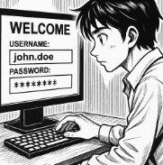

# T01: Gestor de Contrasenyes

**Alerta!!** EverPia ha estat atacada per ciberdelinqüents. La consultora on esteu de becaris ha patit una fuita d’informació (data breach) i informació confidencial sobre un projecte en desenvolupament està ara en mans de delinqüents que amenacen amb publicar-la si no es paga un rescat.  

Això ha causat alarma dins la companyia i s’ha creat un **comitè de crisi** per gestionar la situació.  

La investigació interna ha revelat que un dels comptes tècnics va ser compromès per **una contrasenya feble o reutilitzada**.

Com a resposta, la **Direcció Tècnica** ha emès la directriu que tot el personal tècnic ha de començar a utilitzar un **gestor de contrasenyes validat**. Se us encarrega avaluar les opcions i crear la documentació per a la formació del personal.

---

## Fase 1: Anàlisi i Justificació (Document d'Informe)

Les contrasenyes febles o repetides representen un **risc crític** per a l’empresa, ja que poden ser explotades mitjançant:

- **Atacs de diccionari:** proves de combinacions habituals de paraules o contrasenyes comunes.
- **Credential stuffing:** utilitzar credencials robades en altres serveis on s’hagi reutilitzat la mateixa contrasenya.
- **Enginyeria social o phishing:** enganyar els usuaris perquè revelin informació d’accés.

**Efectes potencials:** accés no autoritzat a dades, pèrdua d’informació confidencial i afectació de la reputació de l’empresa.

Un **gestor de contrasenyes** permet:

- Generar contrasenyes úniques i robustes per a cada servei.
- Emmagatzemar-les de forma xifrada i segura, accessible només amb una contrasenya mestra.
- Facilitar l’autocompletat i sincronització entre dispositius.

**Objectiu de la implantació corporativa:** millorar la seguretat, centralitzar la gestió de credencials i reduir el risc d’incidents.

---

## 2. Comparativa tècnica

| Característica          | Bitwarden (Online / Núvol)                            | KeePassXC (Offline / Escriptori)                              |
|-------------------------|------------------------------------------------------|---------------------------------------------------------------|
| Tipus                   | Núvol, sincronització automàtica entre dispositius   | Local, arxiu `.kdbx` que es pot portar en USB o localment    |
| Xifratge i seguretat    | Xifratge end-to-end AES-256; dades només xifrades al núvol | Xifratge AES-256 local; només l’usuari pot accedir           |
| Accés multiplataforma    | Web, Windows, macOS, Linux, Android, iOS           | Windows, macOS, Linux; portabilitat via arxiu `.kdbx`        |
| Sincronització           | Automàtica via núvol                                 | Manual: cal copiar el fitxer `.kdbx` entre dispositius       |
| Cost / model freemium    | Freemium: bàsic gratuït, opcions premium opcionals  | Totalment gratuït, codi obert                                 |
| Open Source              | Sí                                                   | Sí                                                             |
| Facilitat d’ús           | Molt amigable, integració amb navegadors            | Requereix coneixement tècnic, menys integració automàtica    |

---

## 3. Avantatges i Inconvenients

### Bitwarden (núvol / online)

**Avantatges:**
- Sincronització automàtica entre dispositius.
- Fàcil d’utilitzar.
- Còpies de seguretat al núvol.
- Integració amb navegadors i mòbils.

**Inconvenients:**
- Depèn del proveïdor del núvol.
- Possible risc si el servei online és compromès.

### KeePassXC (offline / escriptori)

**Avantatges:**
- Control total de les dades.
- Sense dependència del núvol.
- Codi obert i molt segur si es gestiona correctament.

**Inconvenients:**
- Sincronització manual.
- Menys còmode per a equips distribuïts.
- Requereix coneixements tècnics.

---

## 4. Recomanació

Es recomana **Bitwarden** per al personal tècnic de l’empresa, pels següents motius:

- Permet sincronitzar automàticament les credencials entre diversos dispositius, facilitant el treball en equip.
- La facilitat d’ús i integració amb navegadors i aplicacions augmenta l’adopció de l’eina.
- Ofereix xifratge end-to-end i còpies de seguretat automàtiques, equilibrant seguretat i comoditat.

