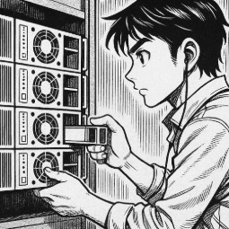

# T03: Gestió flexible de discos (LVM i Espais d’emmagatzematge)

Un cop superada la fase de formació, ja esteu preparats per afrontar el repte dels nostres clients.  
Com ja es va explicar, tenim un nou i important client: **el bufet d’advocats Garriga i Associats**, un dels més prestigiosos de la ciutat, que ha requerit els serveis de la nostra consultora.

Gestiona una gran quantitat d'informació legal sensible, per la qual cosa **la integritat, la disponibilitat (alta redundància)** i **la facilitat de gestió** del seu emmagatzematge són d'importància crítica.

La direcció de *Garriga i Associats* ha expressat la necessitat urgent de renovar els seus sistemes de servidors per garantir que la informació estigui protegida contra fallades de disc i que l'espai pugui ser ampliat sense interrupcions.

Com a tècnics d’**Everpia**, teniu l'encàrrec de **dissenyar i documentar les solucions d'emmagatzematge** que compliran aquests requisits tant en entorns **Linux** com **Windows**.  
Aquest disseny permetrà presentar al client una proposta de solució.

---

## Objectiu principal

Dissenyar i documentar **dues solucions d'emmagatzematge** (una per servidors Linux i una per servidors Windows) que compleixin amb els principis d'**alta disponibilitat, redundància i escalabilitat** per al client.

Com ha de ser una prova de concepte, no treballareu amb servidors, sinó que, per facilitat, **usareu màquines virtuals** de sistemes operatius clients per documentar els procediments.

---

## 1. Part Linux: LVM amb Zorin OS

S'ha d'utilitzar la distribució **Zorin OS** (o una alternativa Linux compatible) per demostrar la utilitat del **Logical Volume Manager (LVM)**.

### Requisits de la Implementació i Demostració

#### 🔹 Configuració Inicial
- Crear un **grup de volums (VG)** i un **volum lògic (LV)** utilitzant inicialment un mínim de **dos discs durs (simulats) de 10 GB** de capacitat.  
- Aquest volum haurà d’estar **formatat i muntat automàticament** al sistema mitjançant l’edició de l’arxiu `/etc/fstab`.

#### 🔹 Alta Disponibilitat
- Implementar la configuració d’un **mirall (lvm_mirror)** que protegeixi la informació davant la fallada d'un disc.

#### 🔹 Instantànies (snapshots)
1. Crear i afegir **dos discos de 10 GB** al grup de volums.  
2. Crear un volum `lvm_dades` amb el **primer disc afegit**, formatar-lo i muntar-lo.  
3. Afegir arxius al volum (poden ser imatges d’Internet).  
4. Usar el **segon disc afegit** per crear un **snapshot (`lv_snapshot`)**.  
5. Documentar com es pot **restaurar aquest snapshot**, per exemple, si la informació del volum original es danyés.

#### 🔹 Escalabilitat
- Demostrar el **procés d'ampliació**:  
  Usar l’espai que quedi lliure dins el grup de volums per **ampliar el volum `lv_dades`**.

---

## 2. Part Windows: Espais d'Emmagatzematge (Storage Spaces)

S'ha d'utilitzar **Windows 11** per demostrar les configuracions possibles mitjançant els **Espais d'Emmagatzematge (Storage Spaces)**.

### Requisits de la Implementació i Demostració

#### 🔹 Configuració inicial
- Crear un **Storage Pool** inicialment amb **tres discos de 10 GB (simulats)**.

#### 🔹 Estudi de Configuracions
Demostrar i documentar la creació d’un **Espai d’Emmagatzematge** utilitzant diferents tipus de resiliència:

- **Resiliència de Mirall (Mirroring)**  
  - Usar **dos dels discos**.  
  - Comprovar que ofereix **alta disponibilitat**.

- **Resiliència de Paritat (Parity)**  
  - Explicar la seva **eficiència d'espai** en comparació amb el mirall.  
  - Cal usar **els tres discos**.

- **Resiliència de Mirall Triple**  
  - Afegir **tants discos de 10 GB com siguin necessaris**.

#### 🔹 Demostració de la Gestió
- Mostrar com es **visualitza l'estat dels discos i del pool** des de la **consola de gestió de Windows**, simulant la **facilitat de manteniment**.

---

## 3. Com treballareu i què lliurareu?

El treball serà **en grup**.  
En primer lloc, us dividireu en **dos equips**:

- Un equip resoldrà la **gestió en equips Linux mitjançant LVM**.  
- L’altre ho farà en **equips Windows usant Espais d’Emmagatzematge**.

### Procés de treball

1. Individualment, **prepareu el guió de la tasca**, cercant les comandes i consultant documentació.  
2. Cada parella realitzarà **la seva part de la demostració**.  
3. Finalment, **el grup revisarà tota la documentació** generada i cada membre la **pujarà al seu repositori**.

---

## 4. Lliurament

- La documentació dels dos casos es farà en **format Markdown**, incloent:
  - Imatges
  - Explicacions
- Tot el material anirà dins una carpeta anomenada `tasca03` dins del projecte.
- L’arxiu `README.md` de la carpeta ha de contenir:
  - La **descripció de la tasca**
  - Els **enllaços** per accedir als dos documents.

> 💡 La nota de la tasca és conjunta al grup, per tant, **organitzeu-vos i manteniu una bona comunicació interna**.

> 🧩 Posteriorment, haureu de **presentar al client les conclusions** de la vostra feina en una **presentació conjunta**.

---

## 5. Material de classe (disponible al Moodle)

- **LVM Linux**  
- **Espais d’emmagatzematge (Windows)**

