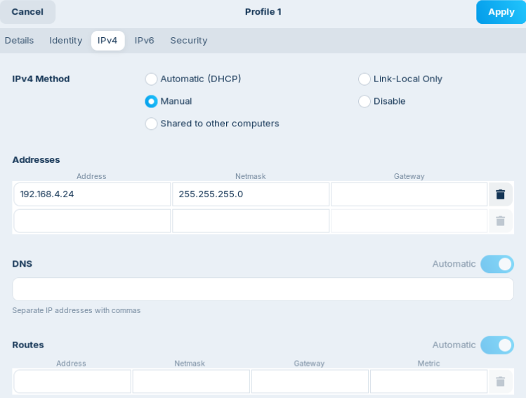
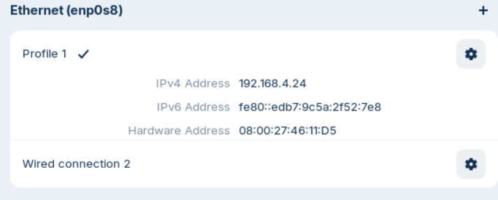
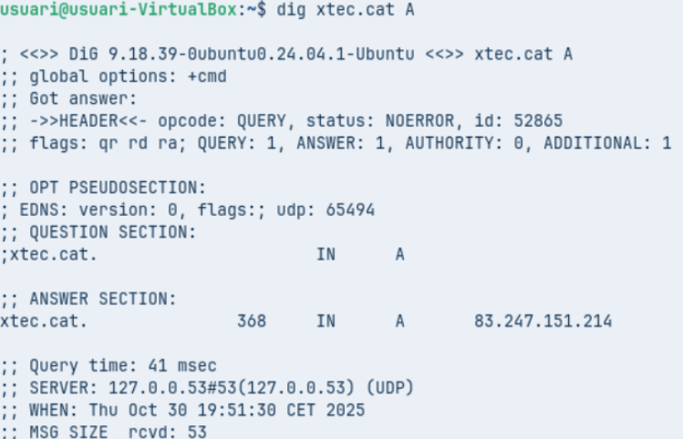
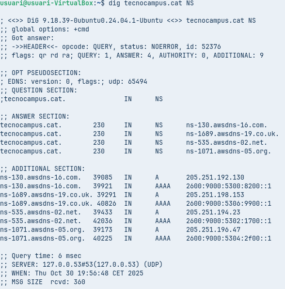
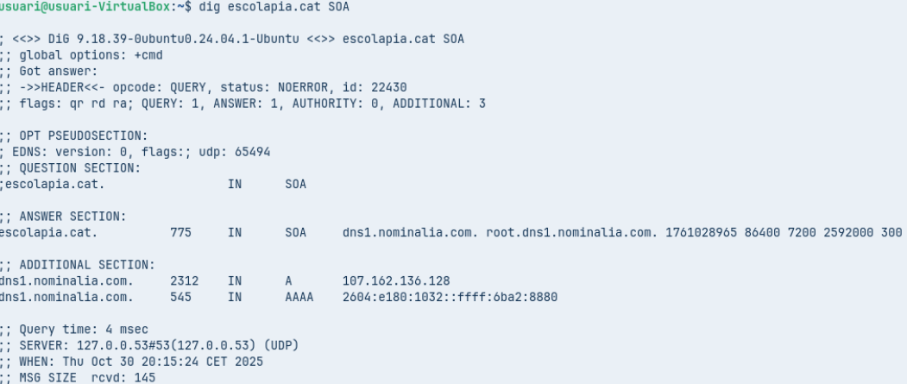
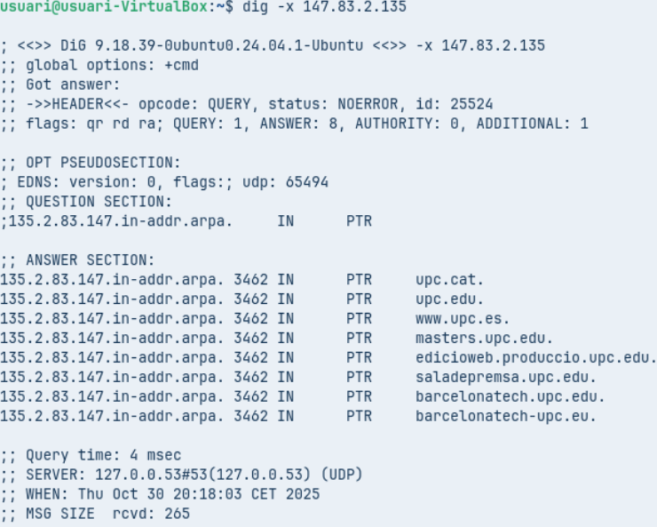
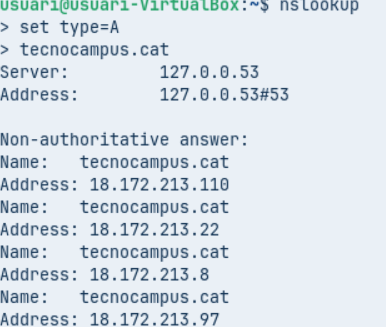
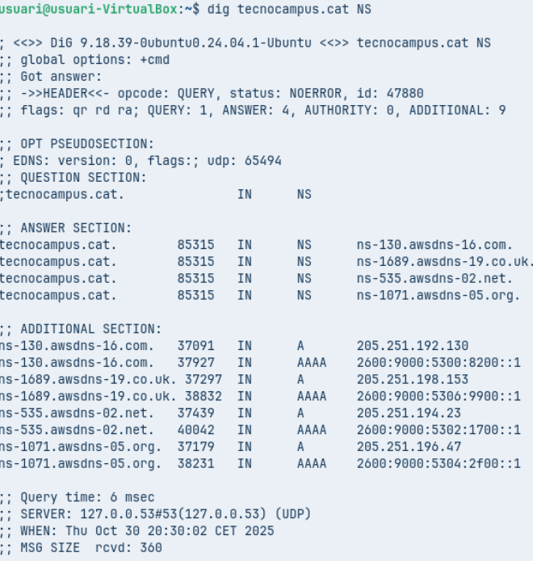
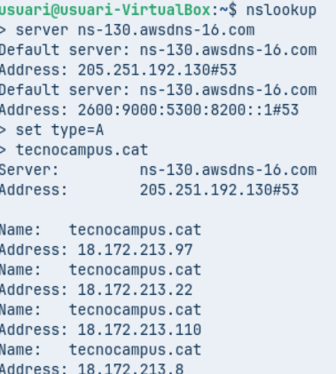
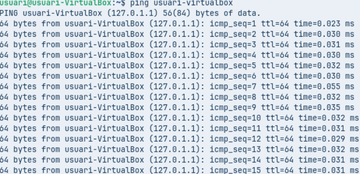

# Fase Pràctica: Diagnosi de Noms (Auditoria amb CLI)

Fiquem desde paràmetres el segon adaptador en adaptador pont, i dintre la màquina anem a modificar la xarxa ficant la IP ([192.168.4.XX](http://192.168.4.XX)), més la màscara.

## A. Diagnosi Avançada amb dig (Linux / macOS)

### Comanda 1: Consulta Bàsica de Registre A
- Executa: `dig xtec.cat A`
- Anàlisi: Identifica la IP de resposta, el valor TTL i el servidor que ha respost a la consulta.

- **IP de resposta:** 83.247.151.214  
- **TTL:** 368 segons  
- **Servidor utilitzat:** 127.0.0.53

### Comanda 2: Consulta de Servidors de Noms (NS)
- Executa: `dig tecnocampus.cat NS`

- Anàlisi: Quins són els servidors de noms autoritatius per a aquest domini?

| Servidor NS | Domini |
| ----------- | ------ |
| ns-130-awsdns-16.com | .com |
| ns-1689-awsdns-19.co.uk | .co.uk |
| ns-535.awsdns-02.net | .net |
| ns-1071-awsdns-05.org | .org |

### Comanda 3: Consulta Detallada SOA
- Executa: `dig escolapia.cat SOA`

- Anàlisi: Quina és la informació del correu de l'administrador i el número de sèrie del domini?

| Correu de l'administrador DNS | root@dns1.nominalia.com |
| ----------------------------- | ---------------------- |

| Número de sèrie del domini (Serial) | 1761028965 |
| ---------------------------------- | ----------- |

### Comanda 4: Consulta resolució inversa
- Executa: `dig -x 147.83.2.135`

- Anàlisi: Quina informació sobre els registres s’obté?

**Registres obtinguts:**

- upc.cat
- upc.edu
- www.upc.es
- masters.upc.edu
- edicionsweb.produccio.upc.edu
- saladepremsa.upc.edu
- barcelonatech.upc.edu
- barcelonatech-upc.eu

## Comprovació de Resolució amb nslookup (Multiplataforma)

### Comanda 1: Consulta Bàsica no Autoritativa
- Seleccionar `type=A` i com a domini de consulta `tecnocampus.cat`

- Anàlisi: Per què indica que la resposta és no autoritativa?

La resposta és no autoritativa perquè el servidor que respon (el teu DNS local) no és el que gestiona directament el domini **tecnocampus.cat**, sinó que actua com a intermediari.

### Comanda 2: Consultes autoritatives
- Escriure `server IP` i escriure la IP del primer servidor de noms del domini `tecnocampus.cat` que s’ha obtingut d’una consulta anterior. A continuació, indiqueu que voleu consultar registres de tipus A i del domini `tecnocampus.cat`.

- Anàlisi: Quines diferències s’observen a la resposta obtinguda amb la comanda 1?

  En la comanda 2 té una resposta autoritativa i en la comanda 1 no.

## Resolucions locals

Finalment es vol comprovar el funcionament de la resolució local, útil per entorns de xarxa local on no es disposa de servidor de noms propi i que evita haver d’accedir a equips o recursos per la seva IP.

Aquest és la màquina del Nezar, on fiques el ping d’un equip que estigui en funcionament, i així veus els diferents pings del mateix.

