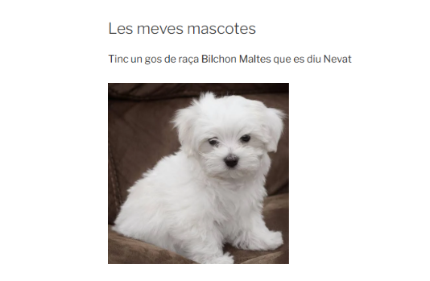
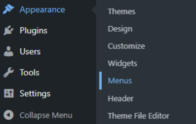

# T11: Instal·lació de WordPress en local amb WP Local – Aplicacions Web

Obrim **Local WP** per obrir la nostra web i el **WP Admin** per administrar-la.

Se’ns obrirà això, que és la pàgina d'inici. Per començar a crear la web, ens ubiquem a la part de l'esquerra on estan les **pàgines**, **entrades**, etc.

Aquesta és la web on estarà tota la informació que és el que veu la gent.  
Nosaltres, des de **WP Admin**, la podrem modificar.

Això és el tema d’**entrades**, on ficarem informació —en el meu cas sobre la sèrie *Prison Break*— i que quedarà dintre de la pàgina **Blog**.

I aquí les **pàgines**, on estan els diferents apartats que es trobaran a la web: *Les meves mascotes*, *Contacte*, *Blog*, etc.  
Si les vols crear directament, has de prémer **Afegir pàgina**. Es fa igual amb les **Entrades**.

Aquesta és la pàgina de **Les meves mascotes**.

La part del **Blog**, on estarà la informació de la sèrie escollida.

I la pàgina de **Contacte**.

Per configurar l’**aparència**, anem a *Aparença* i triem el tema **Twenty Seventeen** i el disseny que més ens agradi.

Després d'haver creat les pàgines amb la informació de cadascuna, anem a *Aparença* → *Menús*, perquè surtin a la web.

Se’ns obrirà aquesta pàgina.  
A la part esquerra sortiran totes les pàgines que hagis creat; has de prémer les que vulguis que apareguin i després, al panell de la dreta, posar-les en l’ordre que vulguis que surtin a la web.  
Quan hagis posat l’ordre, prem **Guardar menú**.

Després anem a *Configuració* → *Lectura* i marquem la **segona opció** per posar la pàgina en **Estàtica**.  
A sota, seleccionem *Benvinguts al meu web personal* i *Blog*, i guardem els canvis.

